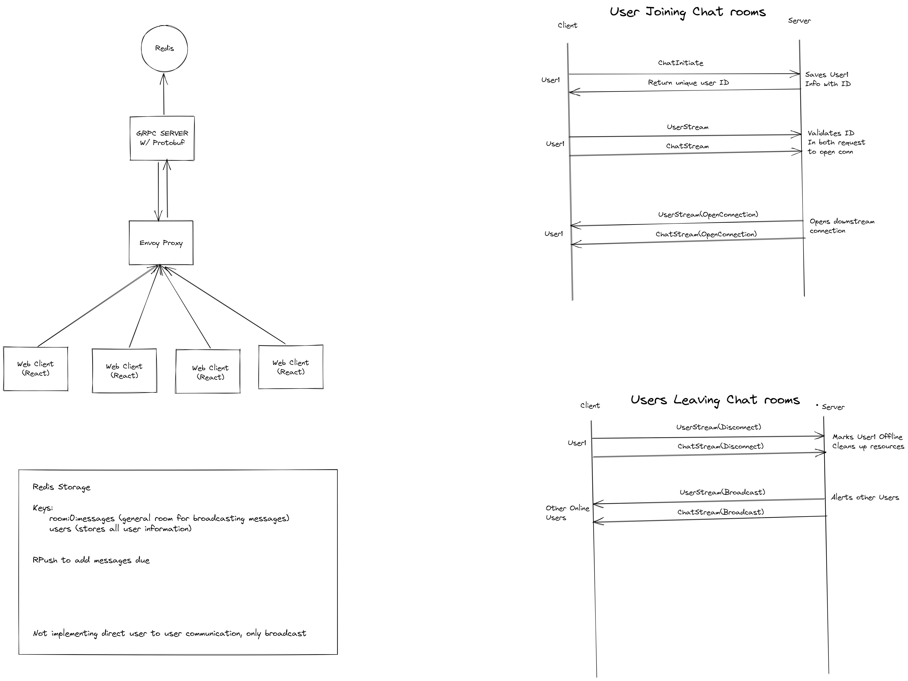

# React gRPC Chat Application still in dev

This is an example of a chat application using gRPC, React, Envoy and Redis.


## design of this application



## Run this application

1. Node npm/yarn
2. Docker
3. protoc

## Project setup

```
docker compose up -d
yarn install
yarn proto:gen
yarn start
cd client && yarn install
yarn start
```
